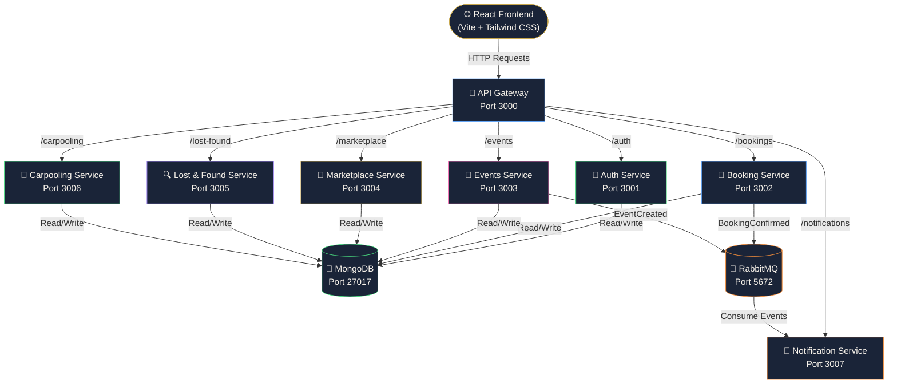

# 🎓 Campus Services Platform

A unified microservices-based web platform that consolidates essential university services for students and staff at ICT University Cameroon.

## 👥 Team
- **Obemo** — Backend Architecture, API Gateway, Docker Deployment
- **Yoyo** — Frontend Development, UI/UX Design, Service Integration

## 🏗️ Architecture

This platform is built using a **Microservices Architecture** with:
- **API Gateway** — Single entry point for all client requests
- **Event-Driven Communication** via RabbitMQ
- **Containerization** via Docker Compose
- **React Frontend** with mobile-responsive design

## 🗺️ Architecture Diagram



## 🚀 Services

| Service | Port | Description |
|---|---|---|
| API Gateway | 3000 | Routes requests to all services |
| Auth Service | 3001 | User authentication & authorization |
| Booking Service | 3002 | Facility booking & management |
| Events Service | 3003 | Campus events & RSVP |
| Marketplace Service | 3004 | Buy & sell within campus |
| Lost & Found Service | 3005 | Report & claim lost items |
| Carpooling Service | 3006 | Share rides between students |
| Notification Service | 3007 | Event-driven notifications |

## 🛠️ Tech Stack

**Backend:**
- Node.js + Express.js
- MongoDB (per service database)
- RabbitMQ (event messaging)
- Docker + Docker Compose

**Frontend:**
- React (Vite)
- Tailwind CSS v4
- React Router DOM
- Axios

## 📦 Installation & Setup

### Prerequisites
- Docker Desktop installed
- Node.js 20+
- Git

### 1. Clone the repository
```bash
git clone https://github.com/YOUR_USERNAME/campus-services-platform.git
cd campus-services-platform
```

### 2. Create environment files
Copy `.env.example` to `.env` for each service:
```bash
cp services/auth-service/.env.example services/auth-service/.env
cp services/api-gateway/.env.example services/api-gateway/.env
```

### 3. Start all services
```bash
docker-compose up --build
```

### 4. Start the frontend
```bash
cd frontend
npm install
npm run dev
```

### 5. Access the app
- **Frontend:** http://localhost:5173
- **API Gateway:** http://localhost:3000
- **RabbitMQ Dashboard:** http://localhost:15672

## 👤 Default Admin Account
- **Email:** admin@campus.com
- **Password:** admin123456

## 📱 Features

### For Students
- 📅 Book computer labs and lecture halls
- 🎉 Browse and RSVP to campus events
- 🛒 Buy and sell items in the marketplace
- 🔍 Report and claim lost items
- 🚗 Post and join carpools

### For Admins
- ✅ Confirm or reject booking requests
- 🏛️ Add, edit and delete facilities
- 📊 View all bookings across campus

## 📄 License
MIT License — ICT University Cameroon, 2026